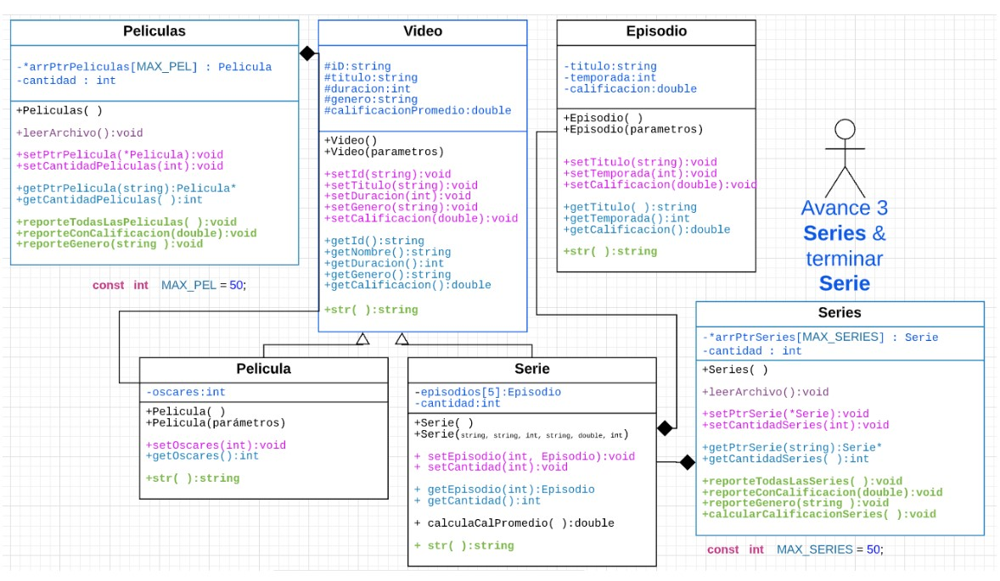

# TC1030-302-GARDUNO_ISABELLA
## A00833573
### ITC
#### Colombia

#### Avanze 2
Teclea la opcion: 2

0-100,Pulp Fiction,178,accion,9.200000,1

1-101,Titanic,194,romance,8.900000,11

2-102,The Trial of the Chicago 7,129,drama,8.900000,0

3-103,Forrest Gump,142,comedia,9.300000,6

4-104,Ford vs Ferrari,152,Accion,9.600000,2

5-105,The Greatest Showman,106,musical,9.300000,0

6-106,Madagascar,86,comedia,8.900000,0

7-107,The Truman Show,103,ficcion,9.500000,0

8-108,Godzilla vs. Kong,113,accion,6.500000,0

9-109,Interestellar,169,ficcion,8.600000,1

10-110,Shrek,92,Aventura,8.700000,1

11-111,Zootopia,110,Aventura,8.000000,1

12-112,Shrek 2,93,Aventura,9.000000,0

13-113,Star Wars Episodio 3,140,Ciencia Ficcion,7.500000,0

14-114,La La Land,128,musical,9.100000,6

15-115,Crazy Rich Asians ,121,Romance,9.100000,0

16-116,Bob Esponja: La película,87,comedia,7.000000,0

17-117,Avengers: Endgame,182,Ciencia Ficcion,9.400000,0

18-118,Raya y el último dragón ,117,Fantasía ,7.500000,0

19-119,El padre de la novia,105,comedia,8.900000,0

20-120,El padre de la novia 2,106,comedia,9.100000,0

21-121,Hacksaw Ridge ,139,Drama,8.500000,2

22-122,Matrix,136,ficcion,9.000000,4

23-123,Catch me if you can ,141,misterio,9.500000,0

24-124,School of Rock,109,comedia,10.000000,0

25-125,The Notebook,124,Romance,7.800000,0

26-126,Forrest Gump,142,Drama,8.800000,5

27-127,Jojo Rabbit,108,comedia,7.900000,1

28-128,The big Lebowski,119,comedia,8.100000,0

29-129,Lord of the Rings: The return of the King,251,aventura,8.900000,11

30-130,Captain Fantastic,119,comedia,7.900000,0

31-131,La teoría del todo,124,drama,7.700000,1

32-132,Arrival,118,Ciencia Ficcion,9.400000,1

33-133,Capitán Phillips,134,Drama,7.800000,0

34-134,Inception,162,Accion,9.400000,4

Promedio: 8.64857

Teclea la opcion:3

10

24 124,School of Rock,109,comedia,10,0

Teclea la opcion: 4

comedia

3 103,Forrest Gump,142,comedia,9.3,6

6 106,Madagascar,86,comedia,8.9,0

16 116,Bob Esponja: La película,87,comedia,7,0

19 119,El padre de la novia,105,comedia,8.9,0

20 120,El padre de la novia 2,106,comedia,9.1,0

24 124,School of Rock,109,comedia,10,0

27 127,Jojo Rabbit,108,comedia,7.9,1

28 128,The big Lebowski,119,comedia,8.1,0

30 130,Captain Fantastic,119,comedia,7.9,0

#### Avance 3

Teclea la opcion: 6

S500,Berserk,20,fantasia,5.000000,3

0:EThe Black Swordsman,1,5.000000

1:EEclipse,1,5.000000

2:EPerpetual Time,1,5.000000

S501,Luis Miguel,45,drama,4.000000,1

0:EMamá Mamá,1,4.500000

S502,Big Bang Theory,20,comedia,4.800000,1

0:EMi verdadero lugar de origen,1,4.800000

S503,The office,30,comedia,4.500000,1

0:ENiagara: Part 2,6,4.700000

S504,Friends,20,comedia,4.700000,1

0:EThe One Everybody Finds Out,5,4.600000

S505,Invincible,40,accion,4.800000,0

S506,Vikingos,42,accion,4.600000,2

0:EMuerte a la reina,4,4.200000

1:EBalder,5,4.800000

S507,Legion,60,ficcion,4.100000,1

0:EChapter 1,1,4.500000

S508,Brooklyn Nine-Nine,22,comedia,4.900000,3

0:EPontiac Bandit,1,4.100000

1:EHalloVeen,5,4.800000

2:ELights Out,7,4.700000

S509,Modern Family,21,comedia,4.300000,3

0:EFifteen Percent ,1,4.000000

1:EFarm Strong ,5,4.500000

2:EDear Beloved Family ,9,3.700000

S510,WandaVision,35,drama,4.100000,3

0:EBreaking the Fourth Wall,1,4.300000

1:EWe Interrupt this Program,1,4.500000

2:EDon't touch that Dial,1,3.900000

S511,Teen Wolf,44,fantasia,4.900000,2

0:EAnchors,3,3.500000

1:EPerishable,4,5.000000

S512,Elite,45,drama,4.300000,2

0:EPolo,3,4.000000

1:E0 horas desaparecido,2,3.800000

S513,How I Met Your Mother,22,comedia,4.100000,1

0:ESlap Bet,2,4.300000

S514,The falcon and the winter soldier,52,accion,4.400000,4

0:ENew World Order,1,4.600000

1:EThe Star-Spangled Man,1,4.300000

2:EPower Broker,1,4.700000

3:EThe Whole World IS Watching,1,5.000000

S515,Community,22,comedia,4.000000,0

S516,Peaky Blinders,55,drama,4.900000,3

0:EBlack Tuesday,5,4.300000

1:EThe Duel,4,4.500000

2:EThe Noose,4,4.800000

S517,Formula 1: Drive to Survive,40,accion,4.000000,3

0:EAll to Play For,1,4.300000

1:EThe King of Spain,1,4.500000

2:ERedemption,1,4.000000

S518,Lucifer,43,crimen,4.700000,3

0:ESin-Eater,2,3.200000

1:EOff the Record,3,4.100000

2:EOur Mojo,5,3.900000

S519,Doctor Who,45,ficción,3.900000,1

0:EThe Woman Who Fell to Earth ,11,3.500000

Promedio Series:4.45

Teclea la opcion:7

4

S501,Luis Miguel,45,drama,4.000000,1

0:EMamá Mamá,1,4.500000

S515,Community,22,comedia,4.000000,0

S517,Formula 1: Drive to Survive,40,accion,4.000000,3

0:EAll to Play For,1,4.300000

1:EThe King of Spain,1,4.500000

2:ERedemption,1,4.000000

S502,Big Bang Theory,20,comedia,4.800000,1

0:EMi verdadero lugar de origen,1,4.800000

S503,The office,30,comedia,4.500000,1

0:ENiagara: Part 2,6,4.700000

S504,Friends,20,comedia,4.700000,1

0:EThe One Everybody Finds Out,5,4.600000

S508,Brooklyn Nine-Nine,22,comedia,4.900000,3

0:EPontiac Bandit,1,4.100000

1:EHalloVeen,5,4.800000

2:ELights Out,7,4.700000

S509,Modern Family,21,comedia,4.300000,3

0:EFifteen Percent ,1,4.000000

1:EFarm Strong ,5,4.500000

2:EDear Beloved Family ,9,3.700000

S513,How I Met Your Mother,22,comedia,4.100000,1

0:ESlap Bet,2,4.300000

S515,Community,22,comedia,4.000000,0

Teclea la opcion:9

7

4.5

100

S501,Luis Miguel,45,drama,4.500000,1
0:EMamá Mamá,1,4.500000

S506,Vikingos,42,accion,4.500000,2
0:EMuerte a la reina,4,4.200000
1:EBalder,5,4.800000

S507,Legion,60,ficcion,4.500000,1
0:EChapter 1,1,4.500000
