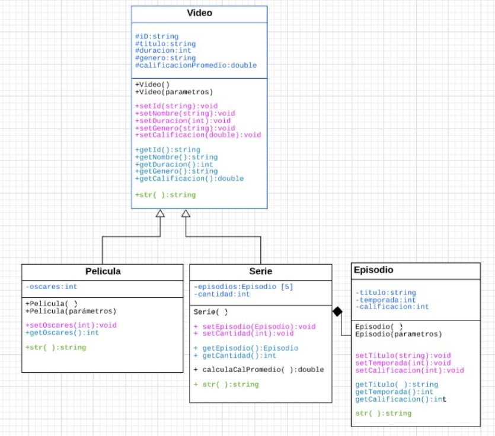

# Isabella Garduño Horneffer
## A00833573
### Avance 1

#### UML - DIAGRAMA DE CLASES

#### Resultados
0-100,Pulp Fiction,178,accion,9.200000,1
1-101,Titanic,194,romance,8.900000,11
2-102,The Trial of the Chicago 7,129,drama,8.900000,0
3-103,Forrest Gump,142,comedia,9.300000,6
4-104,Ford vs Ferrari,152,Accion,9.600000,2
5-105,The Greatest Showman,106,musical,9.300000,0
6-106,Madagascar,86,comedia,8.900000,0
7-107,The Truman Show,103,ficcion,9.500000,0
8-108,Godzilla vs. Kong,113,accion,6.500000,0
9-109,Interestellar,169,ficcion,8.600000,1
10-110,Shrek,92,Aventura,8.700000,1
11-111,Zootopia,110,Aventura,8.000000,1
12-112,Shrek 2,93,Aventura,9.000000,0
13-113,Star Wars Episodio 3,140,Ciencia Ficcion,7.500000,0
14-114,La La Land,128,musical,9.100000,6
15-115,Crazy Rich Asians ,121,Romance,9.100000,0
16-116,Bob Esponja: La película,87,comedia,7.000000,0
17-117,Avengers: Endgame,182,Ciencia Ficcion,9.400000,0
18-118,Raya y el último dragón ,117,Fantasía ,7.500000,0
19-119,El padre de la novia,105,comedia,8.900000,0
20-120,El padre de la novia 2,106,comedia,9.100000,0
21-121,Hacksaw Ridge ,139,Drama,8.500000,2
22-122,Matrix,136,ficcion,9.000000,4
23-123,Catch me if you can ,141,misterio,9.500000,0
24-124,School of Rock,109,comedia,10.000000,0
25-125,The Notebook,124,Romance,7.800000,0
26-126,Forrest Gump,142,Drama,8.800000,5
27-127,Jojo Rabbit,108,comedia,7.900000,1
28-128,The big Lebowski,119,comedia,8.100000,0
29-129,Lord of the Rings: The return of the King,251,aventura,8.900000,11
30-130,Captain Fantastic,119,comedia,7.900000,0
31-131,La teoría del todo,124,drama,7.700000,1
32-132,Arrival,118,Ciencia Ficcion,9.400000,1
33-133,Capitán Phillips,134,Drama,7.800000,0
34-134,Inception,162,Accion,9.400000,4

Teclea el genero que quieres: comedia

3103,Forrest Gump,142,comedia,9.300000,6
6106,Madagascar,86,comedia,8.900000,0
16116,Bob Esponja: La película,87,comedia,7.000000,0
19119,El padre de la novia,105,comedia,8.900000,0
20120,El padre de la novia 2,106,comedia,9.100000,0
24124,School of Rock,109,comedia,10.000000,0
27127,Jojo Rabbit,108,comedia,7.900000,1
28128,The big Lebowski,119,comedia,8.100000,0
30130,Captain Fantastic,119,comedia,7.900000,0

Teclea el genero que quieres: drama

2102,The Trial of the Chicago 7,129,drama,8.900000,0
31131,La teoría del todo,124,drama,7.700000,1

Teclea el genero que quieres: ficcion

7107,The Truman Show,103,ficcion,9.500000,0
9109,Interestellar,169,ficcion,8.600000,1
22122,Matrix,136,ficcion,9.000000,4

Teclea el genero que quieres: romance
1101,Titanic,194,romance,8.900000,11
